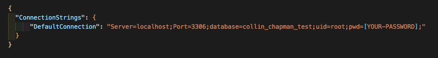

### _This project is not in a complete or portfolio ready state, and should not be considered representiational of professional work._

# Eau Claire's Salon

### Epicodus Independent Code Review - Database Basics

### By Collin Chapman

## Technologies Used

* Git
* C#
* .NET 5.0
* ASP.NET Core
* Entity Framework Core
* Razor View Engine
* MVC
* RESTful Routing, CRUD & HTTP
* REPL
* MySQL MySQL Workbench
* Bootstrap

## Description

This is a C# MVC web application built for Claire to help her manage her employees (stylists) and their clients.

## Setup/Installation Requirements

* _Requires Visual Studio Code Installation_
* _Requires Terminal Installation_
* _Open the terminal on your local machine_
* _Navigate to the directory inside of which you wish to house this project_
* _Clone this project with the following command  `$ git clone <https://github.com/colchapm/HairSalon.Solution.git>`_
* _Next you will need to download and install .NET Core through this link if you don't already have it: https://dotnet.microsoft.com/download_
* _After downloading and installing .NET Core, return to your terminal and navigate to the root directory by entering `$ cd HairSalon.Solution`_
* _Open this project in Visual Studio Code with the command `$ code .`_
* _Still in the terminal, navigate to the desired subdirectory of the repository with the command `$ cd HairSalon`_
* _Retrieve and install packages listed in the .csproj files with the command `$ dotnet restore`_
* _Create internal content for build with the command `$ dotnet build`_

**The following instructions are for re-creating the MySQL Database using `HairSalon\collin_chapman.sql`**
* If you do not have MySQL Workbench, it can be downloaded here: https://dev.mysql.com/downloads/file/?id=484391
* In MySQL Workbench, navigate to the _Administration_ window and click _Data Import/Restore_
* In the _Data Import_ screen, select _Import from Self-Contained File_, click the 3 dots on the right, and navigate to _HairSalon.Solution\collin_chapman.sql_
* Under _Default Scheme to be Import To_ select the _New_ button
  * Enter a name for your database (e.g. collin_chapman_test)
  * Click _Ok_
* Click _Start Import_
* In the _Navigator_ > _Schemas_ tab, right click and select _Refresh All_. The new database will appear.

* _In Visual Studio Code, navigate to the `HairSalon` directory and create an **appsettings.json** file and input the following script (**note the name of the database below needs to match the name of the database you created (e.g. collin_chapman_test)**)_

* _Back in the terminal, navigate to `$ cd HairSalon ` and run the application with the command `$ dotnet run`

## Diagram of the One-To-Many relationship used in this project

## User Stories 

| Functionalities | 
|:---: |
| As the salon owner, Claire needs to be able to see a list of all sylists | 
| As the salon owner, Claire needs to be able to select a stylist, see their details, and see a list of all clients that belong to that sylist | 
| As the salon owner, Claire needs to be able to add new sylists to the system when they are hired | 
| As the salon owner, Claire needs to be able to add new clients to a specific sylist. She should not be able to add a client if no stylists have been added | 

## Known Bugs

No known bugs

## Link

This project is not hosted on GitHub Pages

## License

Copyright (c) 2021 Collin Chapman

This software is licensed under the MIT license

## Contact Information

cchap14@gmail.

